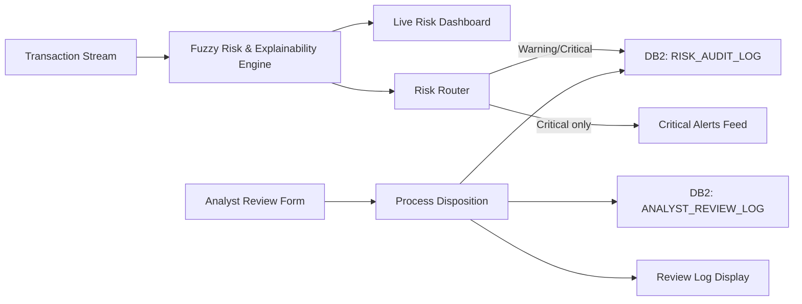
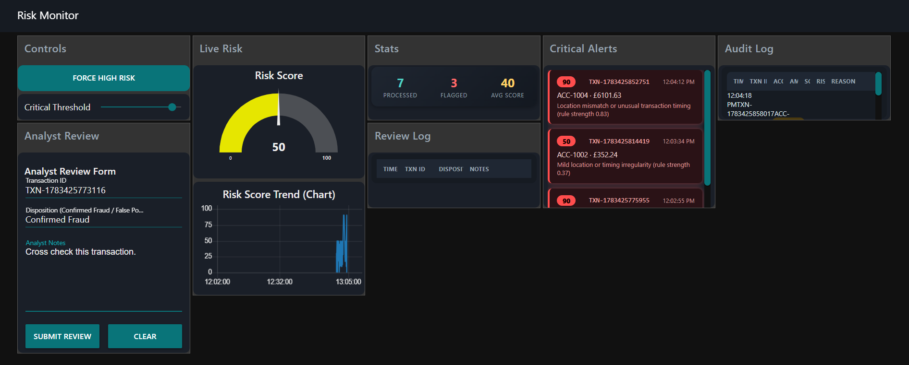
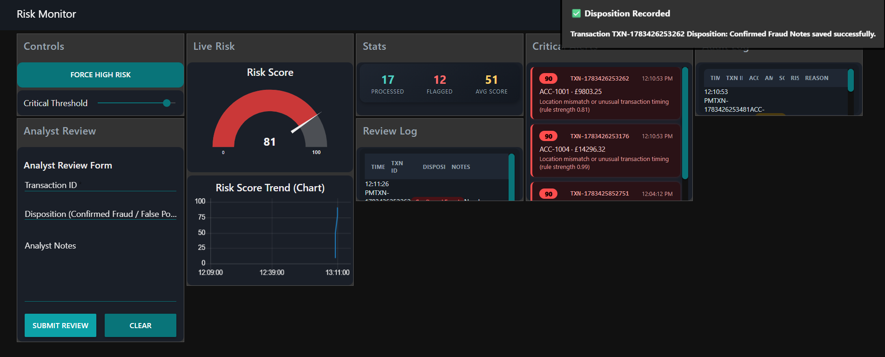
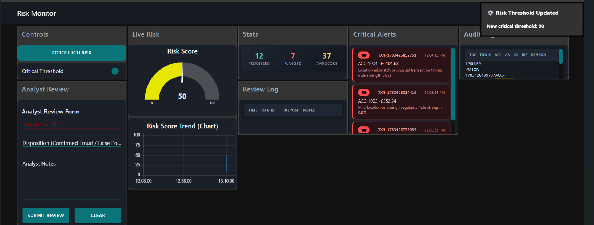
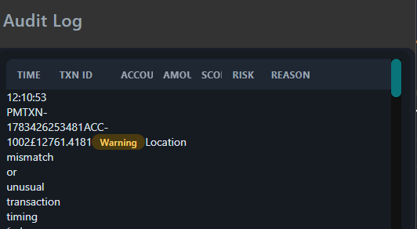

# Explainable Transaction Risk & Compliance Audit System

An IBM i-native, real-time transaction risk monitoring system built during my IIUG Flexible Placement. Unlike typical fraud-detection tools that output an opaque score, this system uses a **Fuzzy Inference Engine** to produce risk scores *with a plain-language reason attached to every decision* — designed for compliance teams who need to justify, not just detect.

**Built on Node-RED + DB2 for i**, running natively on the IBM i platform.

---

## Why explainability matters

Most rule-based or ML fraud systems give you a number: "risk score: 87." That's not enough for a compliance analyst who has to justify why an account got flagged or a payment got held. This system instead surfaces *which* fuzzy rule fired and *how strongly* — e.g. `"Location mismatch or unusual transaction timing (rule strength 0.94)"` — so every decision is auditable, not just detected.

## Key Features

- **Fuzzy Risk Scoring Engine** — evaluates transaction amount, velocity, location mismatch, and time-of-day risk through a Mamdani-style fuzzy inference system, producing a 0–100 risk score plus a human-readable explanation.
- **Live Risk Dashboard** — real-time gauge and trend chart, updating instantly as transactions stream in (no page refresh required).
- **Adjustable Critical Threshold** — analysts can tune the sensitivity of the "Critical" classification live via a dashboard slider.
- **Critical Alerts Feed** — a dedicated, continuously updating panel surfacing only the highest-risk transactions, backed by toast notifications.
- **DB2-Backed Audit Log** — every flagged transaction (Warning or Critical) is permanently written to a DB2 for i table for compliance record-keeping.
- **Analyst Disposition Workflow** — a review form lets analysts mark transactions as *Confirmed Fraud*, *False Positive*, or *Needs Escalation*, with notes.
- **Separate Review Audit Trail** — every analyst decision is written to its own append-only DB2 table, distinct from the automated detection log, preserving full history even if a transaction is reviewed more than once.

## Architecture



## Tech Stack

| Layer | Technology |
|---|---|
| Runtime / orchestration | Node-RED |
| Database | DB2 for i |
| Dashboard | Node-RED Dashboard 1 (custom HTML/CSS templates) |
| Logic | JavaScript (fuzzy membership functions, Mamdani-style rule aggregation) |

## Screenshots

**Live Risk Dashboard** — real-time gauge, trend chart, stats, and Critical Alerts feed all updating together


**Analyst Disposition workflow** — a review is submitted, instantly confirmed via toast, and logged in the Review Log panel


**Adjustable Critical Threshold** — analysts can tune detection sensitivity live from the dashboard


**DB2-backed Audit Log** — every flagged transaction permanently recorded with its fuzzy-engine explanation


## How the Fuzzy Engine Works

1. Four inputs — **amount**, **velocity**, **location mismatch**, **time-of-day risk** — are each fuzzified into Low/Medium/High membership using triangular membership functions.
2. A rule base (e.g. *"large amount combined with high velocity → Critical"*) is evaluated, and the strongest-firing rule is tracked for explainability.
3. Rule outputs are aggregated (Normal/Warning/Critical) and defuzzified via a weighted-average method to produce a final 0–100 severity score.
4. The score is compared against a **live, analyst-adjustable threshold** to assign the final label.

## Database Schema

```sql
-- Automated detection log
CREATE TABLE IUGRED_15.RISK_AUDIT_LOG (
  TRANSACTION_ID VARCHAR(30),
  ACCOUNT_ID     VARCHAR(20),
  AMOUNT         DECIMAL(10,2),
  RISK_SCORE     INT,
  RISK_LABEL     VARCHAR(10),
  REASON         VARCHAR(200),
  CREATED_AT     TIMESTAMP,
  DISPOSITION    VARCHAR(30),
  ANALYST_NOTES  VARCHAR(500),
  REVIEWED_AT    TIMESTAMP
);

-- Separate, append-only analyst decision trail
CREATE TABLE IUGRED_15.ANALYST_REVIEW_LOG (
  REVIEW_ID      INT GENERATED ALWAYS AS IDENTITY,
  TRANSACTION_ID VARCHAR(30),
  ACCOUNT_ID     VARCHAR(20),
  DISPOSITION    VARCHAR(30),
  ANALYST_NOTES  VARCHAR(500),
  REVIEWED_AT    TIMESTAMP
);
```

## Setup

1. Requires Node-RED with [`node-red-dashboard`](https://flows.nodered.org/node/node-red-dashboard) and [`node-red-contrib-db2-for-i`](https://flows.nodered.org/node/node-red-contrib-db2-for-i) installed.
2. Import [`flows/risk_monitor_flow.json`](flows/risk_monitor_flow.json) via the Node-RED editor menu (Import → select file).
3. Configure your own DB2 for i connection in the `DB2 for i Config` node.
4. Deploy, then trigger the one-time "Create Audit Table" and "Create Review Table" inject nodes to set up the schema.
5. Open the dashboard and click **Force High Risk** to generate a sample transaction.

## Acknowledgements

Built as part of my **IBM IIUG Flexible Placement** (Summer 2026), under the guidance of Dr. Liam Naughton and the IIUG team, in partnership with the University of Wolverhampton.

## License

MIT — see [LICENSE](LICENSE).
